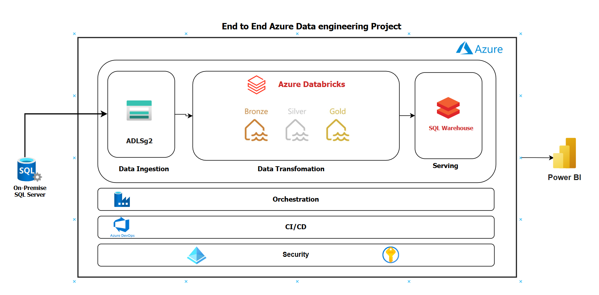
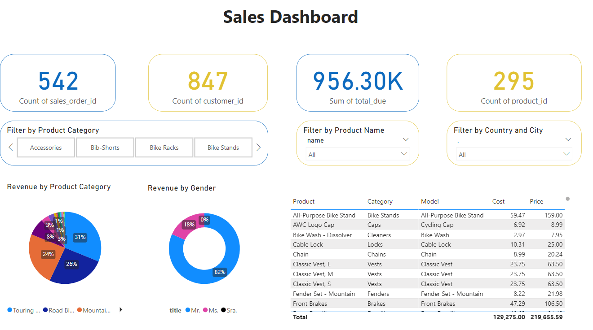

### Project Overview
Welcome to this Azure Data Engineering Project, which demonstrates an end-to-end data pipeline on Azure to process and visualize customer demographics. Built as a learning exercise, it follows best practices in data architecture, security, and CI/CD. The pipeline extracts data from an on-premises SQL database, transforms it using Azure Data Factory and Databricks, and visualizes key metrics like product sales by gender, category, total revenue, and other business KPIs in Power BI.
> **Note:** This project is for learning and demonstration purposes.

### Architecture Diagram

---

### Table of Contents

1. [Project Overview](#project-overview)
2. [Architecture Diagram](#architecture-diagram)
3. [Data Source](#data-source)
4. [Setup and Configuration](#setup-and-configuration)
5. [Data Pipeline](#data-pipeline)
6. [Data Transformation](#data-transformation)
7. [Data Visualization](#data-visualization)
8. [Security](#security)
9. [CI/CD Pipeline](#ci-cd-pipeline)
    
---

### Data Source

- **AdventureWorksLT Database**: This sample database contains tables for customers, products, and sales, simulating a real customer analytics scenario.
- **Data Storage**: Data is ingested from SQL Server into Azure Data Lake in a structured format (Parquet), optimized for transformations and querying.

For detailed setup instructions, see [`docs/data_source.md`](docs/data_source.md).

### Setup and Configuration

This project requires setting up key Azure resources including:
   - **Azure Data Factory** for data ingestion
   - **Databricks** for data transformations
   - **Power BI** for reporting

The configuration includes secure access management with Azure Key Vault and Entra ID.

Refer to [`docs/setup.md`](docs/1_setup.md) for the full setup process.

### Data Pipeline

The data pipeline in **Azure Data Factory** orchestrates data movement and transformation. Data is ingested from an on-premises SQL Server to Azure Data Lake in Parquet format.

See [`docs/data_ingestion.md`](docs/2_data_ingestion.md) for more information on pipeline steps and configurations.

### Data Transformation

Data transformation is handled in **Databricks**, organized in three layers:
   - **Bronze** ->  **Silver** ->  **Gold**: 

More details in [`docs/data_transformation.md`](docs/3_data_transformation.md).

### Data Visualization

**Power BI** connects directly to Databricks, allowing users to interact with the data model and filter by key metrics like gender and product category.

For report setup, check [`docs/data_visualization.md`](docs/4_data_visualization.md).

### Security

Security is managed via:
   - **Azure Key Vault**: Stores secrets and credentials securely.
   - **Managed Identities**: Allows secure connections between services without exposing credentials.
   - **Entra ID**: Provides role-based access control (RBAC).

Refer to [`docs/security.md`](docs/5_security.md) for more on security setup.

### CI/CD Pipeline

The project uses **Azure DevOps** with ARM templates for automated deployment, making it easy to reproduce or modify the setup.

See [`docs/cicd.md`](docs/6_cicd.md) for the CI/CD setup.

---

