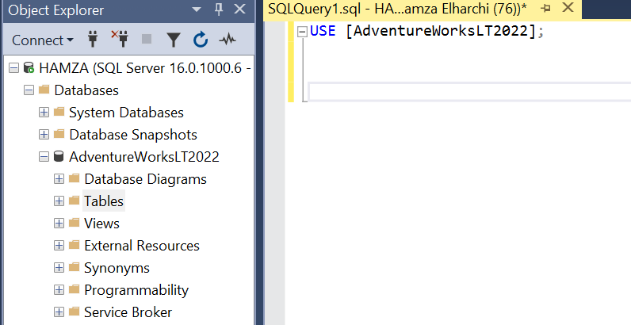

### Data Source: AdventureWorksLT

This file provides an overview of the dataset, setup instructions, and the process for making the data accessible in Azure.

1. **Dataset Description**
    - Brief description of `AdventureWorksLT`, focusing on relevant tables (e.g., `SalesLT.Customer`, `SalesLT.Product`).
    - Link to download or restore the AdventureWorksLT database: [AdventureWorksLT Database](https://github.com/microsoft/sql-server-samples/tree/master/samples/databases/adventure-works)
2. **Setting Up SQL Server and AdventureWorksLT Database**
    - **Steps**:
        - Download SQL Server and SSMS.
        - Restore the `AdventureWorksLT` database from the `.bak` file.
   

3. **Create Cred**

   ``CREATE LOGIN youruser WITH PASSWORD = 'yourpassword'``
   
   ``create user youruser for login youruser``

    - they will be added later to Azure Key Vault.
    - grant select `` GRANT SELECT ON SCHEMA::SalesLT TO youruser``

