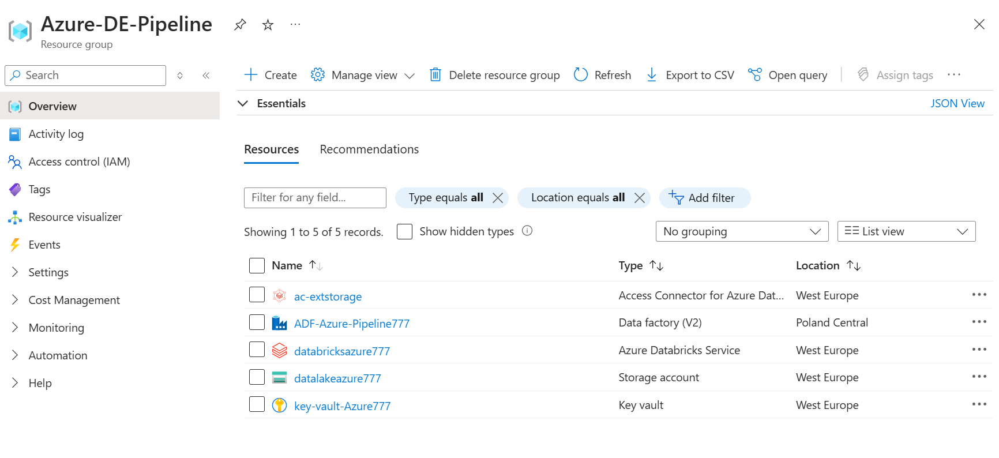
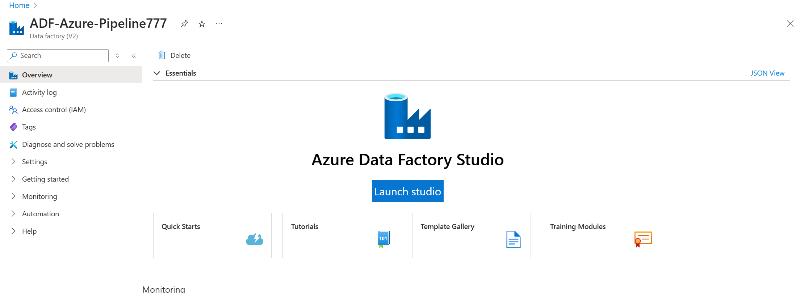
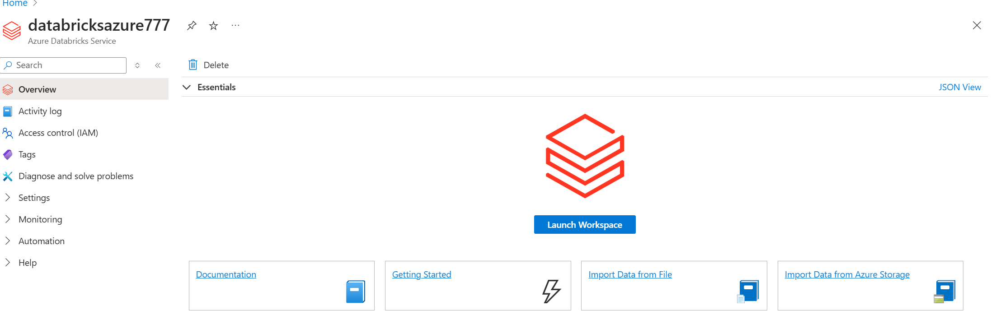

### Setup Env

Use new email get 30 days free with $200 credit
or use Azure for Student if you have student email
Create Resource group
Create ADF
Create Storage Account
    Enable Hierarchical namespace
Create Databricks

### Project Setup: Azure Resources

This file details the creation of Azure resources and initial configuration.

1. **Resource Group and Storage Account**
    - Instructions to create a new Resource Group and Azure Storage Account **(enable hierarchical namespace)**.
    - 
2. **Azure Data Factory (ADF)**
    - Create an Azure Data Factory instance and configure a self-hosted integration runtime to connect to on-prem SQL.
    
4. **Databricks Workspace and Clusters**
     - Create a Databricks workspace.
     