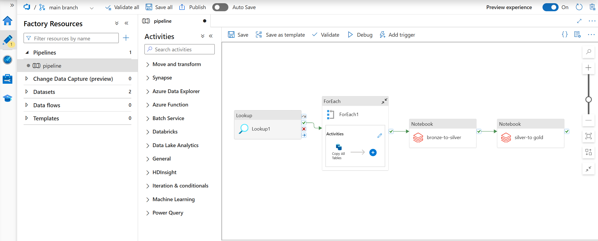

### Data Ingestion with Azure Data Factory



### 1. Lookup Activity: Fetching Table Schema and Names

In the Azure Data Factory pipeline, a **Lookup Activity** is used to dynamically retrieve the schema and table names from the on-premises SQL database. This query focuses on tables within the `SalesLT` schema:

```sql
SELECT
    s.name AS SchemaName,
    t.name AS TableName
FROM sys.tables t
INNER JOIN sys.schemas s
    ON t.schema_id = s.schema_id
WHERE s.name = 'SalesLT'

```

**Explanation**:

- The `Lookup` activity executes this query, which outputs a list of schema and table names in JSON format.
- This output is passed to the **ForEach** activity, which iterates over each table.

---

### 2. ForEach Activity: Copying Data for Each Table

Within the **ForEach Activity**, a **Copy Data Activity** is configured to transfer data from the on-premises SQL database to Azure Data Lake for each table retrieved by the Lookup Activity.

**Dynamic Query for Copy Source**:
The `Copy Data` activity uses a dynamic query to select all data from each table:

```sql
@{concat('SELECT * FROM ', item().SchemaName,'.',item().TableName)}
```

**Sink Configuration**:

- Data is written to Azure Data Lake in a hierarchical format:`bronze/<SchemaName>/<TableName>/<TableName>.parquet`


**Dynamic File Path**:
To achieve this structure, dynamic content is used in the **Sink** configuration:

- Filepath:
  - `@{concat(dataset().schemaname, '/', dataset().tablename)}`
  - `@{concat(dataset().tablename, '.parquet')}`

  