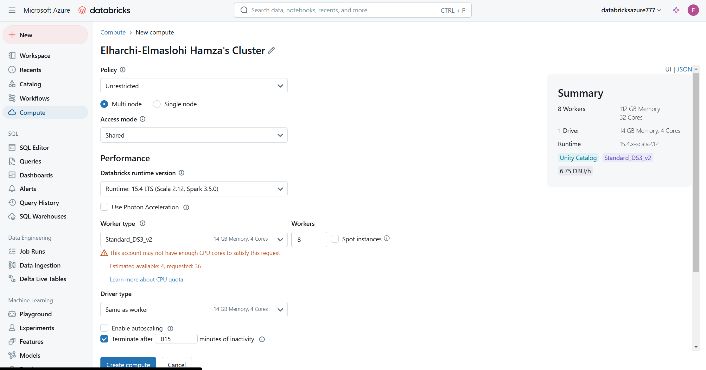
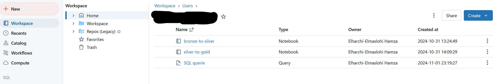

### Data Transformation with Databricks

- in Databricks workspace create compute cluster.
     - 
     - Create your notebook and start doing transformations.
       - Bronze to Silver
       - Silver to Gold
   
     - After finishing with interactive notebook,we will run them later as job clusters in ADF to reduce the cost in Prod.

**Using External Data and External Locations**

For secure and organized data access in Azure Databricks, this project leverages **external data** and **external locations**. These features ensure fine-grained access control and simplify data management within the Databricks workspace.

1. **External Data**:
    - Data stored in Azure Data Lake (bronze, silver, and gold layers) is accessed securely without copying it into Databricks-managed storage.
2. **External Locations**:
    - Defined paths in Azure Data Lake are mapped as **external locations** in Databricks.
    - These locations are linked to Unity Catalog for managing permissions and data governance.
    - Example:
        - External location path: `abfss://bronze@<storage-account>.dfs.core.windows.net/`
3. **Access Control**:
    - Access to external locations is managed via Unity Catalog using role-based permissions.
    - Roles specify which users or groups can read, write, or manage data at specific locations.

- at the end of the notebook, you can save the data to a table in Databricks using
`.saveAsTable("gold.sales")` it will add it to unity catalog and can be accessed by Power BI.