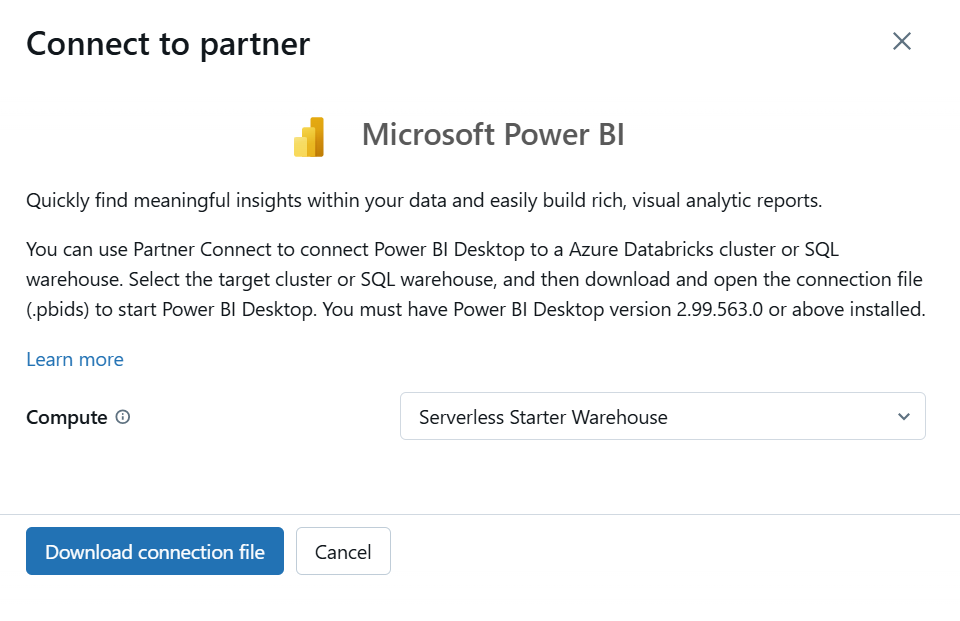

### Data Visualization with Power BI

This file focuses on setting up and connecting Power BI for reporting.

1. **Connecting Power BI to Databricks**
    - link Power BI to the Databricks Unity Catalog for direct querying.
    - Download connection file add access data trough Unity Catalog.
    - 
   

2. **Designing the Dashboard**
    - **Gender and Product Category Visuals**: Instructions to create visuals for gender distribution, product categories, and total sales.
    - **Filters**: Set up slicers for date, gender, and product category.
3. **Power BI Model Configuration**
    - Set up relationships between tables for responsive filtering.

    - 
