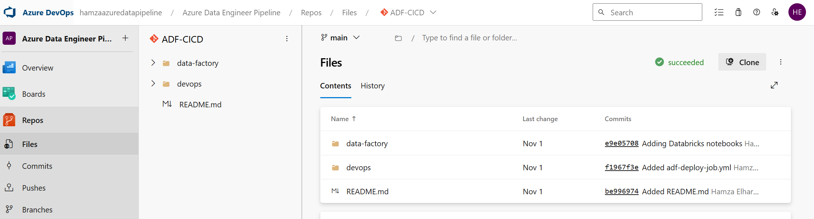

### CI/CD for Azure Data Factory

This project uses Azure DevOps to implement a Continuous Integration and Continuous Deployment (CI/CD) pipeline for managing Azure Data Factory (ADF) resources.

Follow this following repository structure for CI/CD setup:

https://github.com/MarczakIO/azure-enterprise-templates/blob/main/data-factory/devops-build-n-deploy-stages/readme.md